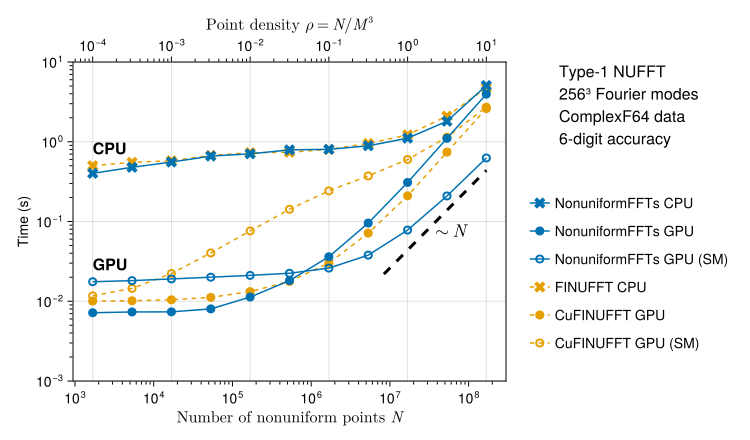

# NonuniformFFTs.jl

[](https://jipolanco.github.io/NonuniformFFTs.jl/stable/)
[](https://jipolanco.github.io/NonuniformFFTs.jl/dev/)
[](https://github.com/jipolanco/NonuniformFFTs.jl/actions)
[](https://codecov.io/gh/jipolanco/NonuniformFFTs.jl)

Yet another package for computing multidimensional [non-uniform fast Fourier transforms (NUFFTs)](https://en.wikipedia.org/wiki/NUFFT) in Julia.

Like other [existing packages](#differences-with-other-packages), computation of NUFFTs on CPU
are parallelised using threads.
Transforms can also be performed on GPUs.
In principle all GPU platforms for which
a [KernelAbstractions.jl](https://github.com/JuliaGPU/KernelAbstractions.jl)
backend exists are supported.

## Basic usage

### Type-1 (or *adjoint*) NUFFT in one dimension

```julia
using NonuniformFFTs

N = 256   # number of Fourier modes
Np = 100  # number of non-uniform points

# Generate some non-uniform random data
T = Float64                # non-uniform data is real (can also be complex)
xp = rand(T, Np) .* T(2π)  # non-uniform points in [0, 2π]
vp = randn(T, Np)          # random values at points

# Create plan for data of type T
plan_nufft = PlanNUFFT(T, N; m = HalfSupport(4))  # larger support increases accuracy

# Set non-uniform points
set_points!(plan_nufft, xp)

# Perform type-1 NUFFT on preallocated output
ûs = Array{Complex{T}}(undef, size(plan_nufft))
exec_type1!(ûs, plan_nufft, vp)
```

### Type-2 (or *direct*) NUFFT in one dimension

```julia
using NonuniformFFTs

N = 256   # number of Fourier modes
Np = 100  # number of non-uniform points

# Generate some uniform random data
T = Float64                        # non-uniform data is real (can also be complex)
xp = rand(T, Np) .* T(2π)          # non-uniform points in [0, 2π]
ûs = randn(Complex{T}, N ÷ 2 + 1)  # random values at points (we need to store roughly half the Fourier modes for complex-to-real transform)

# Create plan for data of type T
plan_nufft = PlanNUFFT(T, N; m = HalfSupport(4))

# Set non-uniform points
set_points!(plan_nufft, xp)

# Perform type-2 NUFFT on preallocated output
vp = Array{T}(undef, Np)
exec_type2!(vp, plan_nufft, ûs)
```

### More examples

<details>
<summary><b>Multidimensional transforms</b></summary>

```julia
using NonuniformFFTs

Ns = (256, 256)  # number of Fourier modes in each direction
Np = 1000        # number of non-uniform points

# Generate some non-uniform random data
T = Float64                # non-uniform data is real (can also be complex)
d = length(Ns)             # number of dimensions (d = 2 here)
xp = rand(T, Np) .* T(2π)  # non-uniform points in [0, 2π] (dimension 1)
yp = rand(T, Np) .* T(2π)  # non-uniform points in [0, 2π] (dimension 2)
vp = randn(T, Np)          # random values at points

# Create plan for data of type T
plan_nufft = PlanNUFFT(T, Ns; m = HalfSupport(4))

# Set non-uniform points
points = (xp, yp)
set_points!(plan_nufft, points)

# Perform type-1 NUFFT on preallocated output
ûs = Array{Complex{T}}(undef, size(plan_nufft))
exec_type1!(ûs, plan_nufft, vp)

# Perform type-2 NUFFT on preallocated output
wp = similar(vp)
exec_type2!(wp, plan_nufft, ûs)
```

</details>

<details>
<summary><b>Multiple transforms on the same non-uniform points</b></summary>

```julia
using NonuniformFFTs

N = 256   # number of Fourier modes
Np = 100  # number of non-uniform points
ntrans = Val(3)  # number of simultaneous transforms

# Generate some non-uniform random data
T = Float64                # non-uniform data is real (can also be complex)
xp = rand(T, Np) .* T(2π)  # non-uniform points in [0, 2π]
vp = ntuple(_ -> randn(T, Np), ntrans)  # random values at points (one vector per transformed quantity)

# Create plan for data of type T
plan_nufft = PlanNUFFT(T, N; ntransforms = ntrans)

# Set non-uniform points
set_points!(plan_nufft, xp)

# Perform type-1 NUFFT on preallocated output (one array per transformed quantity)
ûs = ntuple(_ -> Array{Complex{T}}(undef, size(plan_nufft)), ntrans)
exec_type1!(ûs, plan_nufft, vp)

# Perform type-2 NUFFT on preallocated output (one vector per transformed quantity)
wp = map(similar, vp)  # this is a tuple of 3 vectors
exec_type2!(wp, plan_nufft, ûs)
```

</details>

<details>
<summary><b>Transforms on the GPU</b></summary>

Below is a GPU version of the multidimensional transform example above.
The only differences are:

- we import CUDA.jl and Adapt.jl (optional)
- we pass `backend = CUDABackend()` to `PlanNUFFT` (`CUDABackend` is a [KernelAbstractions backend](https://juliagpu.github.io/KernelAbstractions.jl/stable/#Supported-backends) and is exported by CUDA.jl).
  The default is `backend = CPU()`.
- we copy input arrays to the GPU before calling any NUFFT-related functions (`set_points!`, `exec_type1!`, `exec_type2!`)

The example is for an Nvidia GPU (using [CUDA.jl](https://github.com/JuliaGPU/CUDA.jl)), but should also work with e.g. [AMDGPU.jl](https://github.com/JuliaGPU/AMDGPU.jl)
on an AMD GPU by simply choosing `backend = ROCBackend()`.

```julia
using NonuniformFFTs
using CUDA
using Adapt: adapt  # optional (see below)

backend = CUDABackend()  # other options are CPU() or ROCBackend()

Ns = (256, 256)  # number of Fourier modes in each direction
Np = 1000        # number of non-uniform points

# Generate some non-uniform random data
T = Float64                    # non-uniform data is real (can also be complex)
d = length(Ns)                 # number of dimensions (d = 2 here)
xp_cpu = rand(T, Np) .* T(2π)  # non-uniform points in [0, 2π] (dimension 1)
yp_cpu = rand(T, Np) .* T(2π)  # non-uniform points in [0, 2π] (dimension 2)
vp_cpu = randn(T, Np)          # random values at points

# Copy data to the GPU (using Adapt is optional but it makes code more generic).
# Note that all data needs to be on the GPU before setting points or executing transforms.
# We could have also generated the data directly on the GPU.
points_cpu = (xp_cpu, yp_cpu)
points = adapt(backend, points_cpu)  # returns a tuple of CuArrays if backend = CUDABackend
vp = adapt(backend, vp_cpu)

# Create plan for data of type T
plan_nufft = PlanNUFFT(T, Ns; m = HalfSupport(4), backend)

# Set non-uniform points
set_points!(plan_nufft, xp)

# Perform type-1 NUFFT on preallocated output
ûs = similar(vp, Complex{T}, size(plan_nufft))  # initialises a GPU array for the output
exec_type1!(ûs, plan_nufft, vp)

# Perform type-2 NUFFT on preallocated output
exec_type2!(vp, plan_nufft, ûs)
```

</details>

<details>
<summary><b>Using the AbstractNFFTs.jl interface</b></summary>

This package also implements the [AbstractNFFTs.jl](https://juliamath.github.io/NFFT.jl/stable/abstract/)
interface as an alternative API for constructing plans and evaluating transforms.
This can be useful for comparing with similar packages such as [NFFT.jl](https://github.com/JuliaMath/NFFT.jl).

```julia
using NonuniformFFTs
using AbstractNFFTs: AbstractNFFTs, plan_nfft
using LinearAlgebra: mul!

Ns = (256, 256)  # number of Fourier modes in each direction
Np = 1000        # number of non-uniform points

# Generate some non-uniform random data
T = Float64                      # must be a real data type (Float32, Float64)
d = length(Ns)                   # number of dimensions (d = 2 here)
xp = rand(T, (d, Np)) .- T(0.5)  # non-uniform points in [-1/2, 1/2)ᵈ; must be given as a (d, Np) matrix
vp = randn(Complex{T}, Np)       # random values at points (must be complex)

# Create plan for data of type Complex{T}. Note that we pass the points `xp` as
# a first argument, which calls an AbstractNFFTs-compatible constructor.
p = NonuniformFFTs.NFFTPlan(xp, Ns)
# p = plan_nfft(xp, Ns)  # this is also possible

# Getting the expected dimensions of input and output data.
AbstractNFFTs.size_in(p)   # (256, 256)
AbstractNFFTs.size_out(p)  # (1000,)

# Perform adjoint NFFT, a.k.a. type-1 NUFFT (non-uniform to uniform)
us = adjoint(p) * vp      # allocates output array `us`
mul!(us, adjoint(p), vp)  # uses preallocated output array `us`

# Perform forward NFFT, a.k.a. type-2 NUFFT (uniform to non-uniform)
wp = p * us
mul!(wp, p, us)

# Setting a different set of non-uniform points
AbstractNFFTs.nodes!(p, xp)
```

Note: the AbstractNFFTs.jl interface currently only supports complex-valued non-uniform data.
For real-to-complex transforms, the NonuniformFFTs.jl API demonstrated above should be used instead.

</details>

<br>

## Unique features

Compared to other available packages in Julia, such as [FINUFFT.jl](https://github.com/ludvigak/FINUFFT.jl) and
[NFFT.jl](https://github.com/JuliaMath/NFFT.jl), NonuniformFFTs.jl provides the following unique features:

- Optimised transforms of **purely real non-uniform data**, by taking advantage
  of real-to-complex FFT implementations available in FFTW and in vendor GPU libraries.

- **Generic and fast GPU implementation**, allowing to target different GPU
  platforms thanks to the incredible [KernelAbstractions.jl](https://github.com/JuliaGPU/KernelAbstractions.jl) package.

- User-defined **callback functions**, which can help improve performance and reduce memory requirements in certain applications.
  These can be used to modify input and/or output data "on the fly" when applying a transform.

## Performance

NonuniformFFTs.jl can be *fast*:



On the CPU, for complex non-uniform data, it displays comparable performance to
the [FINUFFT library](https://github.com/flatironinstitute/finufft) written in
C++.
On the GPU it can be faster than the CUDA-based CuFINUFFT, especially for large problem sizes.

And the results above are for complex non-uniform data.
One can obtain important [additional gains](https://jipolanco.github.io/NonuniformFFTs.jl/dev/benchmarks/#benchmarks-real) if
one is interested in problems where non-uniform data is real-valued.

See the [Performance
benchmarks](https://jipolanco.github.io/NonuniformFFTs.jl/dev/benchmarks/)
section of the documentation for details and more benchmarks.
